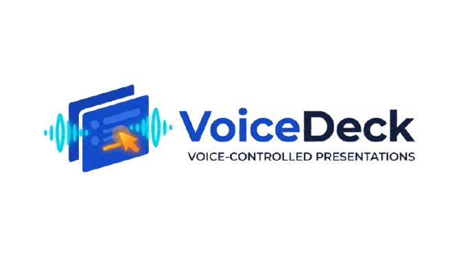

<p align="center">
  
</p>

<h1 align="center">VoiceDeck</h1>

<p align="center">
  <strong>Hands-Free Presentation & Pitching Assistant with Real-Time Speech Architecture</strong><br />
  Advance slides, navigate seamlessly, and highlight crucial metrics on screen using only your voice — 100% offline and low-latency.
</p>

<p align="center">
  
  
  
  
  
</p>

---

## 💡 Overview

When presenting pitch decks or competing in high-stakes startup competitions, manual clickers or laptop trackpads disrupt eye contact, body language, and storytelling flow. Furthermore, drawing audience focus to critical numbers (e.g., *Revenue, CAC, LTV, Growth Rate*) usually requires manual pointers.

**VoiceDeck** solves this by acting as an invisible AI stage assistant:
- **Zero Clicker Navigation:** Speak triggers like *"Next slide"* or *"Go back"* to navigate slides across any presentation software (PowerPoint, Google Slides, PDF full screen, Keynote, Canva, Reveal.js).
- **Voice-Activated Highlighting:** Say *"Highlight revenue"* or *"Highlight traction"* to dynamically project glowing, high-visibility annotations and banners directly over your slides.
- **100% On-Device & Stage-Ready:** Operates completely offline with zero internet dependency, eliminating risks associated with unstable venue Wi-Fi.

---

## 🏗️ Speech & System Architecture

VoiceDeck leverages a streaming, dual-speed speech processing pipeline engineered for instant reaction times and rock-solid stability under stage noise:

```
                  [ Microphone Input (16kHz PCM Stream) ]
                                     │
                                     ▼
                      [ AudioCapture & Ring Buffer ]
                                     │
                                     ├───> [ Energy VAD & Dynamic Noise Adaptation ]
                                     │
                                     ▼
                     [ Vosk ASR Engine (Local / Offline) ]
                                     │
                   ┌─────────────────┴─────────────────┐
                   ▼                                   ▼
        [ Partial Result Stream ]             [ Final Transcript Stream ]
         (Ultra-low latency <100ms)               (Full Utterance Intent)
                   │                                   │
                   ▼                                   ▼
         [ Intent Parser (KWS) ]              [ Entity & Intent Parser ]
          - "next", "lanjut"                   - "highlight <keyword>"
          - "back", "kembali"                  - "clear"
                   │                                   │
                   ▼                                   ▼
         [ SlideController ]                  [ HighlightOverlay ]
     (Simulates Key.right / Key.left)     (Transparent Click-Through Canvas)
     - Smart Cooldown Debounce (1.2s)     - Always-on-top HUD
     - Prevents double-trigger            - Neon spotlight & auto-fade (3.5s)
```

### Architectural Highlights
1. **Low-Latency Partial Streaming:** Decodes streaming audio frames continuously. Fast navigation keywords trigger slide switches immediately without waiting for long sentence pauses.
2. **Transparent Click-Through Overlay:** Built with PyQt6 with `Qt.WindowStaysOnTopHint`, `WA_TranslucentBackground`, and `WA_TransparentForInput`. All mouse clicks pass directly through to your presentation.
3. **Anti Double-Trigger Debouncing:** Intelligent cooldown timer ensures rapid presenter speech does not accidentally skip multiple slides.
4. **Emergency Panic Switch:** One-click mute toggle and global hotkeys prevent false activations during Q&A sessions with judges.

---

## 🚀 Quick Start

### Option 1: One-Click Windows Launch (Recommended)
Navigate to `C:\Users\Pongo\VoiceDeck` in Windows File Explorer and double-click:
```bat
run.bat
```

### Option 2: Terminal / PowerShell
```powershell
# 1. Navigate to directory
cd C:\Users\Pongo\VoiceDeck

# 2. Run with the pre-configured virtual environment
.\.venv\Scripts\python.exe main.py
```
*(On first execution, VoiceDeck automatically verifies and sets up the offline Vosk speech model in `models/`)*

---

## 🗣️ Supported Voice Commands

| Action | English Triggers | Indonesian Triggers |
| :--- | :--- | :--- |
| **Next Slide** | `"next"`, `"next slide"`, `"forward"` | `"lanjut"`, `"berikutnya"`, `"maju"` |
| **Previous Slide** | `"back"`, `"previous"`, `"go back"` | `"kembali"`, `"mundur"`, `"sebelumnya"` |
| **Highlight Text** | `"highlight <word>"`, `"mark <word>"` | `"sorot <kata>"`, `"tandai <kata>"` |
| **Clear Highlight** | `"clear"`, `"clear highlight"` | `"hapus"`, `"hilangkan"` |

> **Real Stage Examples:**
> - *"Moving on to the **next slide**..."* ➔ Slide advances immediately.
> - *"Please **highlight revenue** here..."* ➔ Displays glowing banner: **✨ REVENUE**.

---

## ⚙️ Configuration (`config.yaml`)

Customize trigger words, audio sensitivity, and overlay visual parameters directly:

```yaml
app:
  name: "VoiceDeck"
  version: "1.0.0"
  language: "en" # 'en' (English) or custom model
  panic_hotkey: "ctrl+shift+m"

audio:
  sample_rate: 16000
  chunk_size: 4000
  silence_threshold_rms: 0.015

control:
  debounce_seconds: 1.2 # Cooldown between slide transitions
  keywords:
    next:
      - "next"
      - "next slide"
      - "lanjut"
      - "berikutnya"
    previous:
      - "previous"
      - "back"
      - "kembali"
    highlight:
      - "highlight"
      - "sorot"
      - "tandai"

overlay:
  auto_fade_seconds: 3.5
  highlight_color: "#FFE50088"
```

---

## 📂 Project Directory Structure

```text
VoiceDeck/
├── assets/
│   └── logo.svg                    # Vector brand logo
├── config.yaml                     # Application settings & keyword triggers
├── requirements.txt                # Python dependencies
├── run.bat                         # Windows one-click launcher
├── main.py                         # Application entrypoint & worker coordinator
├── README.md                       # Documentation & architecture specifications
├── tests/
│   └── test_pipeline.py            # End-to-end pipeline verification test
├── voicedeck/
│   ├── audio/
│   │   ├── capture.py              # Threaded audio capture, ring buffer & VU meter
│   │   └── vad.py                  # Energy VAD with adaptive noise floor tracker
│   ├── engine/
│   │   └── speech_engine.py        # Vosk Kaldi offline speech recognizer
│   ├── controller/
│   │   ├── slide_controller.py     # Keyboard dispatcher (Right/Left) & debouncing
│   │   └── intent_parser.py        # NLP regex & entity extractor
│   ├── overlay/
│   │   └── canvas.py               # Transparent click-through overlay window
│   ├── ui/
│   │   └── app.py                  # PyQt6 Control Dashboard & live monitor
│   └── downloader.py               # Automatic model manager
└── models/
    └── vosk-model-small-en-us-0.15/ # Pre-bundled offline ASR model
```

---

## 🧪 Running Verification Tests

Run the built-in test suite to verify the audio VAD, intent parser, and local Vosk engine without needing a microphone:

```powershell
.\.venv\Scripts\python.exe tests/test_pipeline.py
```

---

## 📄 License
MIT License. Built for presenters, startup founders, and public speakers.
